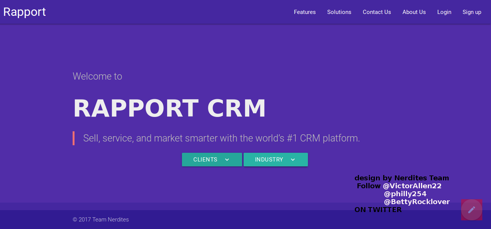

#####  Web App Screenshot
##### [View demo](https://rapportcrm1.herokuapp.com/)

# Rapport

Rapport is a Customer Relations Management System that helps businesses boost their sales through keeping track of client's contact and also adding prospect customers.

## Getting Started and Installing

These instructions will get you a copy of the project up and running on your local machine for development and testing purposes. See deployment for notes on how to deploy the project on a live system.

* Clone this repo: `git clone https://github.com/pmutua/Rapport.io.git`
* Change to the repo directory: `cd Rapport`
* Install gems: `bundle install --path vendor/bundle`
* Run the app: `ruby app.rb`

## Database Setup Instructions

rake db:create

### Prerequisites

```
Ruby
Postgres
Sinatra
bundler gem

```


## Running the tests
We are using Rspec for tests.


## Built With

* [Sinatra](http://www.sinatrarb.com/) - The DSL web framework used
* [Materialize ](http://materializecss.com/) - A modern responsive front-end framework based on Material Design
* [Ruby](http://ruby-doc.org/) - Main language used in this project
* [bundler](http://bundler.io/) - Gem Dependency Management
* [PostgresSQL](https://www.postgresql.org/) - Database Management
* [CSS3](http://www.css3.com/) - For front end styling
* [JS](http://materializecss.com/) - For front end styling
* [HTML5](https://developer.mozilla.org/en-US/docs/Web/Guide/HTML/HTML5)
=======
* [PostgresSQL](https://www.postgresql.org/) - Database Management
* [CSS3](http://www.css3.com/) - For front end styling
* [HTML5](https://developer.mozilla.org/en-US/docs/Web/Guide/HTML/HTML5)


We use [SemVer](http://semver.org/) for versioning. For the versions available, see the [tags on this repository](https://github.com/your/project/tags).

## Authors

* Betty Mutai - [BettyMutai](https://github.com/BettyMutai)
* Victor Allen - [vamuigua](https://github.com/vamuigua)
* Philip Mutua - [pmutua](https://github.com/pmutua)


## Authors

* **Betty Mutai** - *Initial work* - [Software Developer](https://github.com/pmutua)
* **Philip Mutua** - *Initial work* - [Software Developer](https://github.com/BettyMutai)
* **Victor Muigua** - *Initial work* - [Software Developer](https://github.com/vamuigua)


## License

This project is licensed under the MIT License - see the [LICENSE.md](LICENSE.md) file for details
